# Movie BarCode Generator

I was watching a video online and they were using these "movie barcodes" as part of a trivia game. As a huge cinephile myself, I thought "_Surely I'll be able to decipher what some of these things are._" Much to my disappointment, by the end of it I was barely able to do so. This was in part due to the completely foreign nature of the images themselves, but also due to how similar they all looked. The developer in me simply could not let this go. I kept telling myself, "_There must be a better method to produce more recognizable images._" And so I fell down the rabbit hole.

I quickly found that this is actually not a novel concept at all. It's been around for years, and I had just never seen one. I discovered a handful of existing projects that produce these barcodes. In the end I settled on [this one](https://github.com/mlaily/MovieBarCodeGenerator). It was relatively simple, straightforward code that was structured in a way that look easy to extend, **and** it had both a CLI and a GUI. For more information on the original project you can check out their website [here](https://zerowidthjoiner.net/movie-barcode-generator).

After some hacking at the code for a while, I decided it best to create my own fork since the project seems to have died and I was about to make a substantial amount of changes.

And so here we are.

## About the code

Much of the original base code remains intact. At its core, it is a wrapper around FFmpeg. The bulk of the functionality is under Core and I have plans to organize this section better as I continue expanding it. The CLI and GUI sections are what they say on the tin. I have not done much with the CLI section just yet, but I have given the GUI a bit of a facelift so that it doesn't immediately remind me of being an awkward teen. I've replaced all of the old WinForms components with components from the Krypton standard toolkit, given it a light and dark mode, and moved the output logs into their own window. I've even added a few new generators that produce some more recognizable results.

There's a new "credits detector" that's halfway decent. It makes use of a combination of edge density and brightness to do its best to locate the beginning of end credits, and then feeds that to FFmpeg before starting to generate the output image. This removes the dark bars from the end of most previously generated images. It is certainly not foolproof, however, as any end credits with bright backgrounds will not be detected - although this does make some movies immediately recognizable.

The new dominant color generator paints bars the most dominant color found in each frame, which produces a much cleaner barcode than the existing methods did before.

The new subject color generator take it a bit further and makes use of blob extraction and morphological functions to detect the biggest object in frame and combines that with the dominant color methods to produce the best looking barcodes so far.

There are other new generators in there as well, and I still have idea left to try.

## Usage

This is your standard Visual Studio project. You should be able to clone the repo, open it up in VS, and either run or build it as-is. You can get a listing and explanation of all command line parameters with `.\MovieBarCodeGenerator.exe --help` and both the CLI and GUI are capable of doing batch processing when provided with directories rather than specific file names. There are also tooltips in the GUI to provide more details.

## Examples

For those of you who would rather look at the shiny pictures, here are some pics of the reskinned interface and some samples to show some of the different generators that are currently available.

| Light | Dark |
|--|--|
| 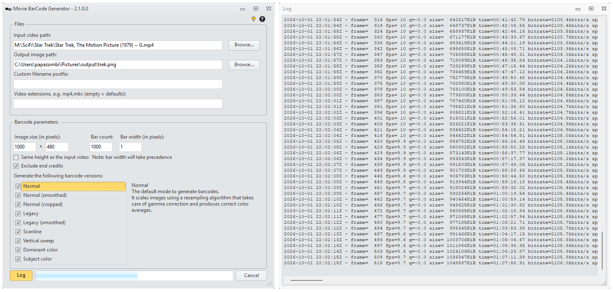 | 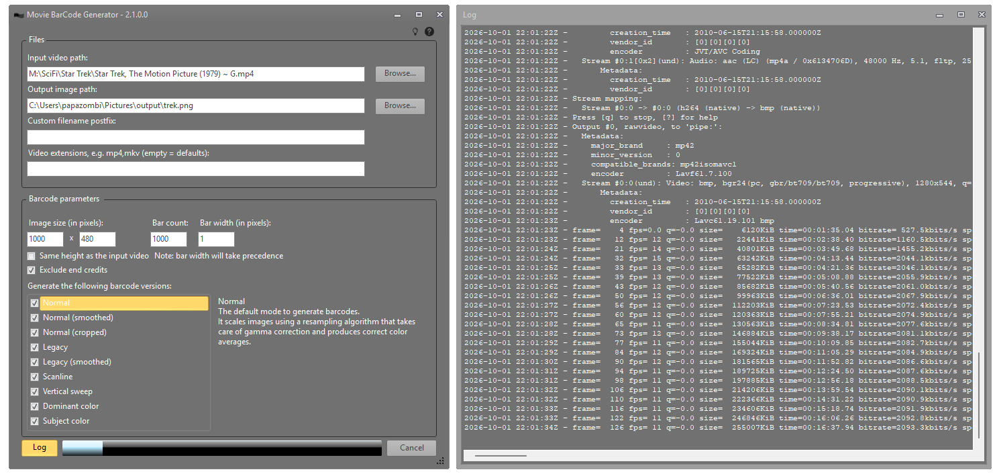 |

| Vertical Sweep | Normal | Smoothed |
|--|--|--|
| 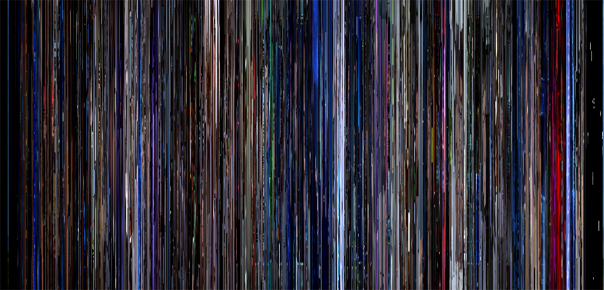 | 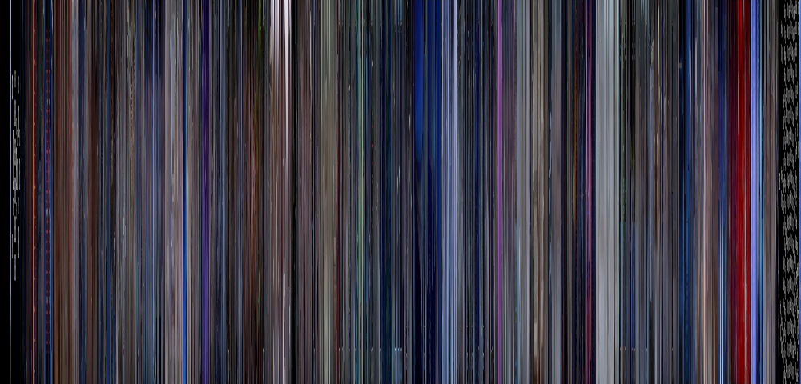 | 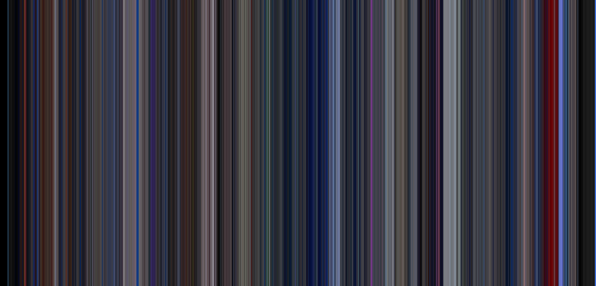 |
| 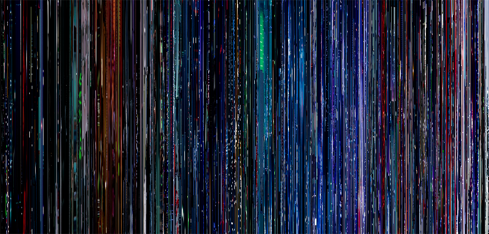 | 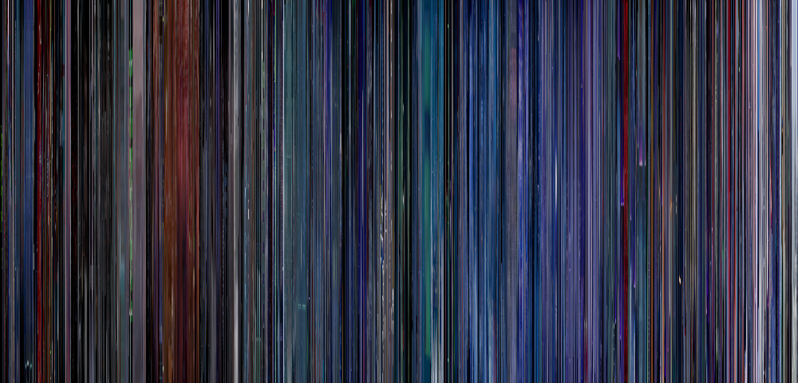 | 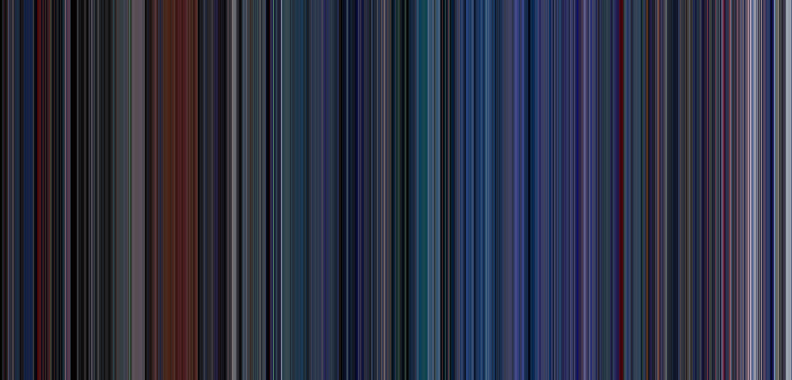 |

| Scanline | Dominant color | Subject color |
|--|--|--|
| 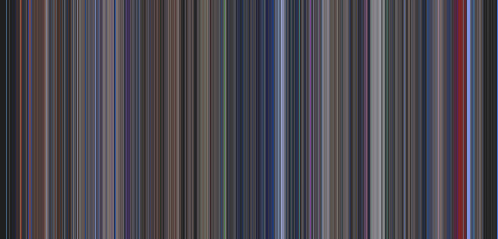 | 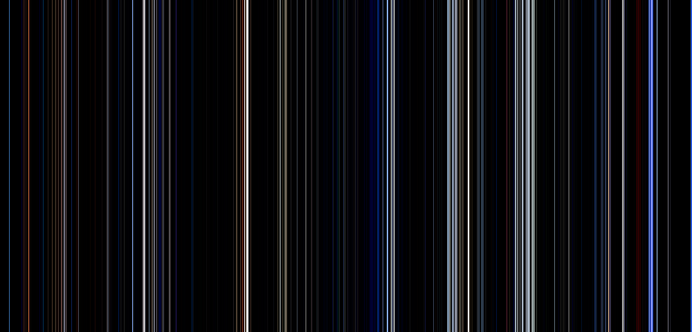 | 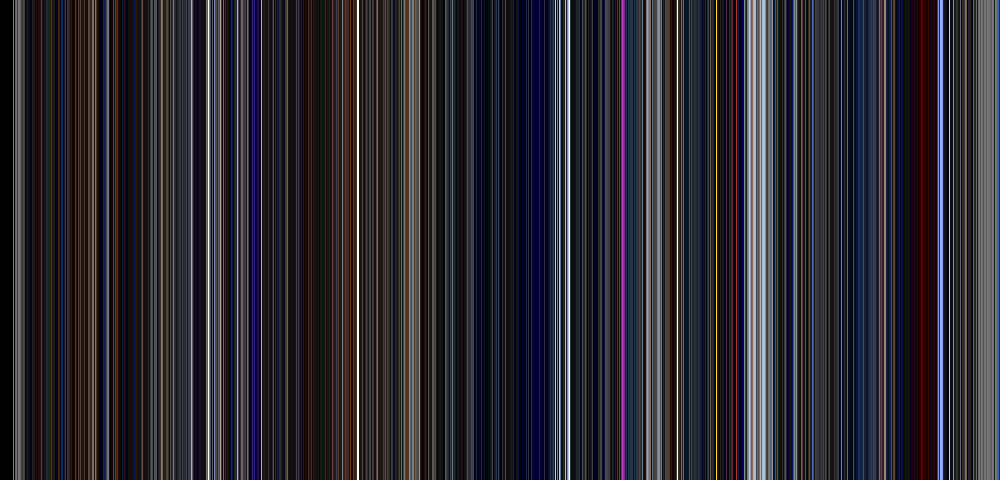 |
| 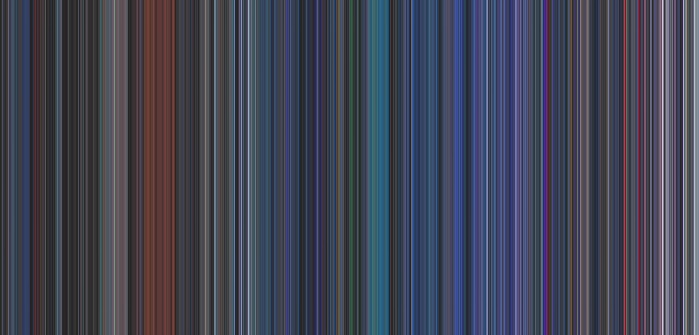 |  | 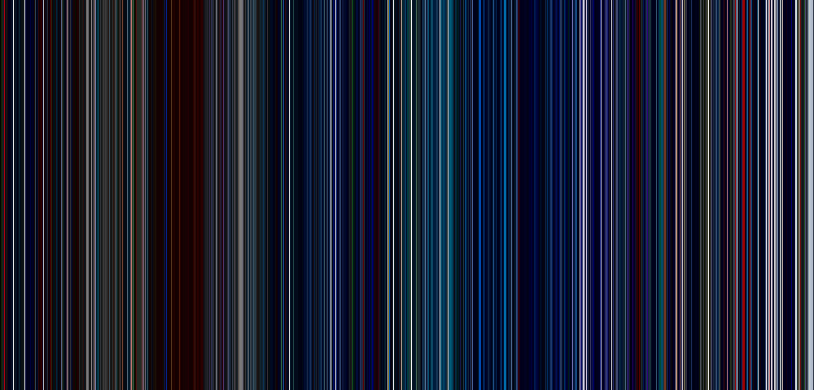 |

## License

This code is released under its original [GPL license](License.txt)

The following projects were used and are subject to their own licensing/restrictions:

- [PhotoSauce MagicScaler](https://github.com/saucecontrol/PhotoSauce) _[MIT](https://github.com/saucecontrol/PhotoSauce?tab=MIT-1-ov-file)_
- [Krypton Standard Toolkit](https://github.com/Krypton-Suite/Standard-Toolkit) _[BSD 3-Clause](https://github.com/Krypton-Suite/Standard-Toolkit?tab=BSD-3-Clause-1-ov-file)_
- [FFmpeg](https://ffmpeg.org/) _[LGPL-2.1](https://www.gnu.org/licenses/old-licenses/lgpl-2.1.html)_